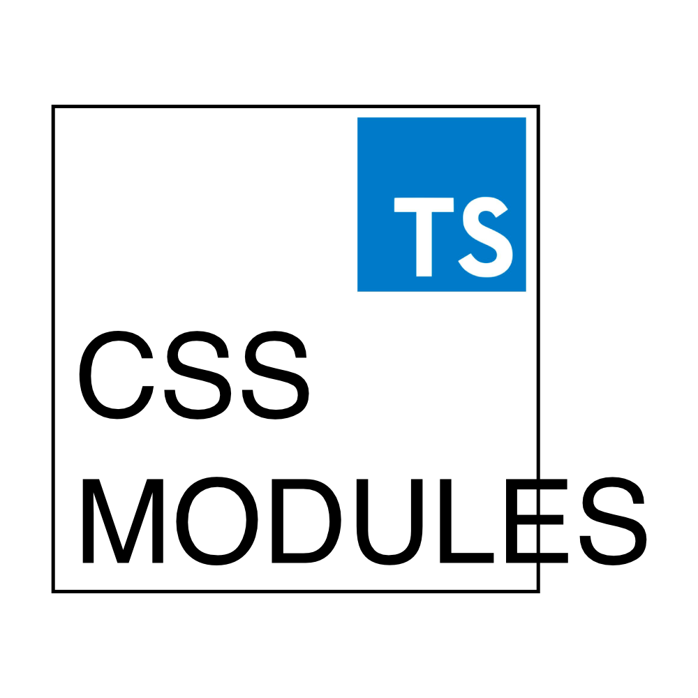

# CSS Module Typed



Creates `.d.ts` files from css-modules `.css`/`.less`/`.scss`/`.sass`/`.styl` files.

## Install

Install deps first:

```shell
# require
npm install typed-css-modules

# if you need less
npm install less

# if you need scss/sass
npm install sass

# if you need stylus
npm install stylus
```

Modules can be installed globally. `yarn` is supported.

To switch the package manager (`npm` or `yarn`), you need to change the settings `npm.packageManager` of the built-in module `vscode.npm`.

## Configuring

By default, the option to automatically format `.d.ts` files using eslint is enabled. You can disable this feature through the setting `"typed-css-modules.eslint.enable": false`.

## Usage

put

```scss
// @type
```

or

```css
/* @type */
```

ahead of your `.css`/`.less`/`.scss`/`.sass`/`.styl` file, and save, you will get a `d.ts` file in same directory.

## preview


